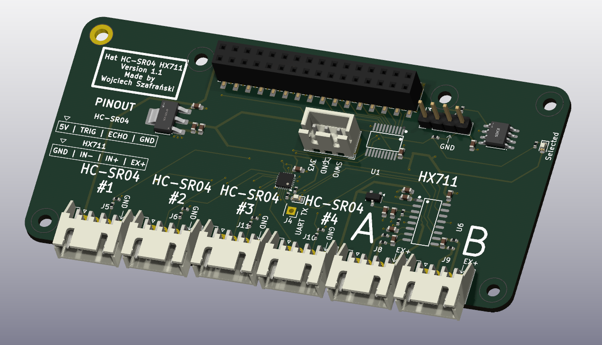

# Hat 4x HC-SR04 i Przetwornika Tensometrycznego HX711

## Sekcja 1: Dokumentacja Hat'a

### Krótki opis projektu
Hat obsługuje cztery zewnętrzne ultradźwiękowe czujniki odległości HC-SR04 oraz dwukanałowey, 24-bitowego przetwornika dla belek tensometrycznych HX711.

Sercem modułu jest mikrokontroler **CH32V003**, który odczytuje dane z czujników i udostępnia je do odczytu po I2C

### Zgodność ze standardem ChainBus

* ✅ Używa złącza ChainBus, nie zmienia jego miejsca ani pinoutu.
* ✅ Używa wyłącznie interfejsu I2C do komunikacji zewnętrznej (działa jako Slave, nie inicjuje transmisji jako Master).
* ✅ Spełnia wymagania mechaniczne standardu (wymiary PCB, rozstaw otworów).
* ✅ Pobiera prąd mieszczący się w limitach wyznaczonych dla pojedynczego modułu (CH32V003 może wyzwalać czujniki ultradźwiękowe sekwencyjnie w celu redukcji zakłóceń i szpilek prądowych).
* ✅ Obsługuje napięcie wejściowe BRD_VIN do wartości 48V.

### Komunikacja i adresowanie

#### Adresacja I2C
Komunikacja z modułem nadrzędnym odbywa się przez magistralę I2C. Adres mikrokontrolera CH32V003 jest definiowany programowo.

| Układ (IC)   | Funkcja                               |     Adres I2C (7-bit)     |
| :----------- | :------------------------------------ | :-----------------------: |
| **CH32V003** | Mikrokontroler (konwerter protokołów) | *Konfigurowalny w sofcie* |
| **M24C64-W** | Pamięć EEPROM (identyfikacja modułu)  |     `1010000b` (0x50)     |

### Pinout mikrokontrolera CH32V003

Rozprowadzenie sygnałów sterujących na piny mikrokontrolera przedstawia poniższa tabela:

| Pin MCU | Nazwa sygnału | Kierunek | Opis funkcjonalny                                              |
| :------ | :------------ | :------: | :------------------------------------------------------------- |
| **PC0** | `ECHO #1`     | Wejście  | Sygnał Echo z czujnika ultradźwiękowego nr 1                   |
| **PC1** | `SDA`         | Wej/Wyj  | Linia danych magistrali I2C (ChainBus)                         |
| **PC2** | `SCL`         | Wejście  | Linia zegarowa magistrali I2C (ChainBus)                       |
| **PC3** | `TRIG #1`     | Wyjście  | Sygnał wyzwalający (Trigger) dla czujnika nr 1                 |
| **PC4** | `ECHO #2`     | Wejście  | Sygnał Echo z czujnika ultradźwiękowego nr 2                   |
| **PC5** | `TRIG #2`     | Wyjście  | Sygnał wyzwalający (Trigger) dla czujnika nr 2                 |
| **PC6** | `ECHO #3`     | Wejście  | Sygnał Echo z czujnika ultradźwiękowego nr 3                   |
| **PC7** | `TRIG #3`     | Wyjście  | Sygnał wyzwalający (Trigger) dla czujnika nr 3                 |
| **PD0** | `ECHO #4`     | Wejście  | Sygnał Echo z czujnika ultradźwiękowego nr 4                   |
| **PD2** | `TRIG #4`     | Wyjście  | Sygnał wyzwalający (Trigger) dla czujnika nr 4                 |
| **PD3** | `RATE_HX`     | Wyjście  | Wybór prędkości próbkowania HX711 (`0` = 10 SPS, `1` = 80 SPS) |
| **PD4** | `PD_SCK_HX`   | Wyjście  | Zegar transmisji oraz wyłączenie zasilania (Power Down) HX711  |
| **PD5** | `DEBUG_TX`    | Wyjście  | Wyjście do debugowania (USART TX)                              |
| **PD6** | `DOUT_HX`     | Wejście  | Wyjście danych szeregowych z przetwornika HX711                |

Dodatkowo na PD6 jest podłączona dioda, można jej użyć do debugowania
---

### Pinout złączy zewnętrznych

#### Złącza czujników ultradźwiękowych
Moduł posiada cztery  złącza w do podłączenia czujników odległości HC-SR04.

| Pin złącza | Nazwa sygnału | Opis                                          |
| :--------: | :------------ | :-------------------------------------------- |
|   **1**    | `5V`          | Zasilanie czujnika (5V z magistrali ChainBus) |
|   **2**    | `TRIG`        | Sygnał wyzwalający                            |
|   **3**    | `ECHO`        | Sygnał powrotny                               |
|   **4**    | `GND`         | Masa zasilania                                |

#### Złącze belki tensometrycznej (J5)
Złącze przeznaczone do podłączenia czujnika siły / wagi (belki tensometrycznej w układzie mostka Wheatstone'a). Sygnały wejściowe są dopasowane do specyfikacji Kanału B układu HX711.

| Pin złącza | Nazwa sygnału | Opis                                              |
| :--------: | :------------ | :------------------------------------------------ |
|   **1**    | `EX+` (E+)    | Dodatnie napięcie zasilania mostka (Excitation +) |
|   **2**    | `INB+`        | Dodatni sygnał wyjściowy z mostka (Input B+)      |
|   **3**    | `INB-`        | Ujemny sygnał wyjściowy z mostka (Input B-)       |
|   **4**    | `GND` (E-)    | Masa zasilania mostka (Excitation -)              |

#### Złącze programowania mikrokontrolera (J7)
Złącze debugowania i programowania struktury CH32V003 przy użyciu WCH Link-E.

| Pin złącza | Nazwa sygnału | Opis                                                      |
| :--------: | :------------ | :-------------------------------------------------------- |
|   **1**    | `SWIO`        | Linia danych SWD (podłączona do pinu PD1 mikrokontrolera) |
|   **2**    | `GND`         | Masa odniesienia                                          |
|   **3**    | `3V3`         | Zasilanie układu logiki (3.3V)                            |

---
### Szczegółowy opis działania układu

#### Sekcja ultradźwiękowa (HC-SR04)
Mikrokontroler CH32V003 cyklicznie generuje impuls wyzwalający piny `TRIG x`. Następnie mierzy czas trwania stanu wysokiego na powiązanym pinie `ECHO x`. Pomiar ten jest przeliczany na odległość zapisywany w rejestrach wewnętrznych MCU, gotowych do odczytu przez magistralę I2C.

#### Sekcja wagowa (HX711)
Układ HX711 przetwarza mikrowoltowe różnice napięć z mostka tensometrycznego na postać cyfrową.
* **Proces odczytu:** MCU monitoruje stan linii `DOUT_HX` (PD6). Gdy linia przejdzie w stan niski, oznacza to gotowość danych. Mikrokontroler taktuje linię `PD_SCK_HX` (PD4), odczytując kolejno 24 bity danych, a następnie generuje dodatkowe impulsy w celu konfiguracji następnego pomiaru (np. 26 impulsów, aby utrzymać odczyt z Kanału B ze wzmocnieniem 32).

#### Charakterystyka i parametry przetwornika HX711

Układ HX711 jest dedykowanym, 24-bitowym przetwornikiem ADC ze zintegrowanym niskoszumnym przedwzmacniaczem (PGA). Posiada on dwa różnicowe kanały wejściowe, które różnią się zakresem napięć oraz czułością:

#### Różnice między Kanałem A i Kanałem B

1. **Wzmocnienie i zakresy wejściowe (przy zasilaniu $V_{DD} = 5\text{V}$):**
   * **Kanał A:** Posiada programowalny stopień wzmocnienia równy **128** lub **64**.
     * Dla wzmocnienia **128**: zakres napięcia wejściowego wynosi **$\pm 20\text{ mV}$** (pełna skala). Jest to najbardziej czuły zakres, zalecany dla większości typowych belek tensometrycznych.
     * Dla wzmocnienia **64**: zakres napięcia wejściowego wynosi **$\pm 40\text{ mV}$**.
   * **Kanał B:** Posiada stałe, fabrycznie zdefiniowane wzmocnienie **32**.
     * Zakres napięcia wejściowego wynosi **$\pm 80\text{ mV}$**. Kanał ten, dzięki szerszemu zakresowi i mniejszej czułości, doskonale nadaje się do obsługi czujników o wyższym poziomie sygnału wyjściowego lub pomiarów pomocniczych.

2. **Wybór aktywnego kanału:**
   Multipleksacja kanałów wejściowych odbywa się programowo poprzez podanie odpowiedniej liczby impulsów zegarowych na pin `PD_SCK` po odczytaniu danych (wejście `DOUT` w stanie niskim):
   * **25 impulsów zegarowych:** następny pomiar na Kanale A ze wzmocnieniem 128,
   * **26 impulsów zegarowych:** następny pomiar na Kanale B ze wzmocnieniem 32,
   * **27 impulsów zegarowych:** następny pomiar na Kanale A ze wzmocnieniem 64.

3. **Częstotliwość próbkowania (SPS):**
   Prędkość konwersji jest ustawiana sprzętowo poprzez stan pinu `RATE_HX` (PD3):
   * Stan niski (`0`): **10 SPS** (próbek na sekundę). Zapewnia najniższy poziom szumów i najwyższą stabilność pomiarów wagowych (zalecane).
   * Stan wysoki (`1`): **80 SPS**. Zwiększa dynamikę pomiarów kosztem nieznacznego wzrostu szumu przetwornika.

---

---

### Gotowe arkusze hierarchiczne
W projekcie zaprojektowano i użyto następujących arkuszy hierarchicznych:
* **CH32v003** – Arkusz mikrokontrolera
* **Ultrasonic_HC-SR04** – Arkusz z podłączeniem HC-SR04 oraz dzielnikami napięcie 5V -> 3V3.
* **HX711_LoadCell** – Układ przetwornika HX711 ze wszytkimi elementami pasywnymi i złaczem

---

## Sekcja 2: Specyfikacja standardu ChainBus

### Architektura i łączenie modułów
Standard ChainBus umożliwia modułowe łączenie hatów. Na jednym MMS3 można zamontować pionowo **do 8 hat'ów**. Połączenie realizowane jest poprzez wpięcie złącza męskiego kolejnego hat'a w złącze żeńskie poprzedniego.

### Komunikacja i sterowanie
Magistrala ChainBus jest w pełni cyfrowa. Płyta główna nie steruje bezpośrednio sygnałami ogólnego przeznaczenia (GPIO) na poszczególnych hat'ach. Wszelkie operacje (np. odczyt czujników, sterowanie) muszą być realizowane przez dedykowane układy scalone komunikujące się przez interfejsy systemowe.

Wybór aktywnego modułu realizowany jest przez układ przełącznika magistrali (bus switch) na płycie głównej. Dzięki temu linie I2C, SPI i UART są niezależne dla każdego hat'a (brak konfliktów adresów I2C między różnymi hatami).
* **Identyfikacja:** Każdy moduł powinien posiadać pamięć EEPROM na magistrali I2C w celu identyfikacji płyty przez system - układ M24C64-W skonfigurowany na adres `1010000` przy liniach adresowych A0, A1, A2 zwartych do masy.

### Zasilanie
Złącze ChainBus dostarcza następujące linie zasilania:

| Magistrala zasilania | Napięcie znamionowe | Maksymalny prąd (łączny dla 8 hatów) | Szacowany prąd na jeden hat |
| :------------------- | :-----------------: | :----------------------------------: | :-------------------------: |
| **5V**               |        5.0 V        |                1.0 A                 |           125 mA            |
| **12V stby**         |       12.0 V        |                0.5 A                 |            65 mA            |
| **BRD_VIN**          |   12.0 V – 48.0 V   |                1.5 A                 |           185 mA            |

*   Komponenty podłączone do linii `BRD_VIN` muszą być przystosowane do pracy z napięciem od 12V do **48 V**.

---

## Sekcja 3: Licencje

### Licencje projektu

*   **PCB:** CERN-OHL-P
*   **Software:** MIT License

[Template](https://github.com/KoNaR-Hefajstos/MMS3_hat_templates/) jest na licencji CC0 1.0 Universal. **Reszta projektu nie jest na tej licencji**
